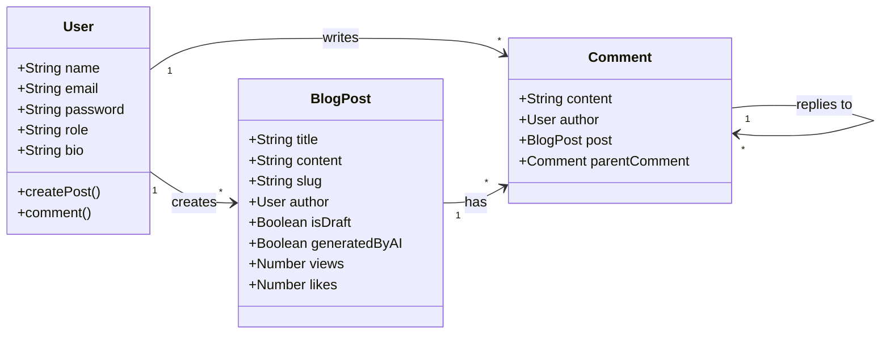

# MERN Stack Blog Application

A full-featured, modern blogging platform built with the MERN stack (MongoDB, Express, React, Node.js). This application features AI-powered content generation, a rich text editor, nested comments, and a comprehensive admin dashboard.

## 🚀 Features

- **Authentication & Authorization**: Secure Login and Signup functionality using JWT (JSON Web Tokens).
- **Blog Management**:
  - Create, edit, and delete blog posts.
  - Rich Text Editor support for immersive writing.
  - Upload cover images.
  - Tagging system for posts.
- **AI Integration**: Leverage Google Gemini AI to auto-generate creative blog content.
- **Interactive Comments**:
  - Threaded (nested) comments system.
  - Real-time updates.
- **Admin Dashboard**:
  - Visual analytics with charts (Post views, User growth).
  - Manage users and posts.
- **Responsive Design**: Built with Tailwind CSS for a seamless experience on mobile and desktop.
- **Search & Filter**: Find posts easily by title or tags.
- **Smart Empty States**: User-friendly messaging and actions when no data is available.
- **Image Hosting**: Integrated with Cloudinary for persistent image storage.

## 🛠️ Tech Stack

### Client (Frontend)

- **Framework**: React (Vite)
- **Styling**: Tailwind CSS, CSS Modules
- **State Management**: Context API
- **Routing**: React Router DOM
- **Charts**: Recharts
- **HTTP Client**: Axios
- **Icons**: React Icons

### Server (Backend)

- **Runtime**: Node.js
- **Framework**: Express.js
- **Database**: MongoDB (with Mongoose ODM)
- **Authentication**: JWT, bcryptjs
- **File Uploads**: Multer, Cloudinary
- **AI**: Google Generative AI SDK

## 📐 Business Logic & Architecture

The following diagram illustrates the core relationships between the data models in the system:



## 🏁 Getting Started

### Prerequisites

- Node.js (v18+ recommended)
- MongoDB (Local or Atlas)

### Installation

1.  **Clone the repository**

    ```bash
    git clone <repository_url>
    cd blog
    ```

2.  **Setup Server**

    ```bash
    cd server
    npm install
    cp .env.example .env
    # Configure your .env variables:
    # - MONGO_URI
    # - GOOGLE_API_KEY (for AI)
    # - CLOUDINARY_CLOUD_NAME, CLOUDINARY_API_KEY, CLOUDINARY_API_SECRET (for Images)
    npm run dev
    ```

3.  **Setup Client**
    ```bash
    cd ../client
    npm install
    cp .env.example .env
    # Configure VITE_API_BASE_URL
    npm run dev
    ```
